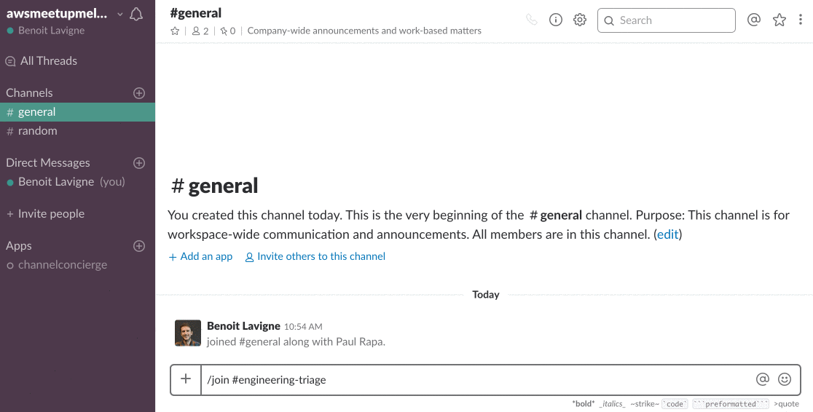

# What is this?
This repo contains code and instructions to build a Slack app and host it on AWS. It is split into 3 branches, each containing instructions for a different version of the app, walking you through the different steps of the configuration on each side.

## Slack App:
Slack channels can be used in a variety of ways, and teams often create dedicated channels for specific purposes. However, users joining a channel may not be aware of the channel's workflows and conventions. Adding this info to the channel's topic and purpose can be useful, but you may want to make sure new users have read them, and this is what this app facilitates.

When a user joins a channel, the app will send them an ephemeral message detailing the channel's topic and purpose, and ask them to confirm that they've read it by clicking a button. When the button is clicked, the app will post a message visible to everyone in the channel.

This app will give you an overview of the following components:
- The [Events API](https://api.slack.com/events-api): Apps can subscribe to specific events, and receive a payload when they occur. This will kick off our app's workflow
- The [Web API](https://api.slack.com/web): Apps can use the web API to read / write Slack data. The web API allows this app to get the channel's topic and purpose, and to post messages in the channel
- [Interactive messages](https://api.slack.com/interactive-messages): Apps can add interactive elements to create rich workflows. This app uses a button, which when clicked will send a request to a specified endpoint.

## AWS config:

This app will use 2 AWS' services:
- The API gateway alllows us to create the two endpoints and HTTP methods that Slack will send requests to: one for the Events API, and an other for interactive messages.
- Each endpoint will be mapped to a specific Lambda function, runnning python code which will handle the actual processing of the incoming payload: parsing the data and returning the right response. You will find the code for each function in each branch of this repo.

We'll use CloudFormation to build the endpoints and Lambda functions. This will automatically add the corresponding Python code to your Lambdas, but we'll also provide the code in each branch for reference.

# Get Started:

## What you'll need
- A Slack workspace where you can create and install apps. If needed, you can create a [free Slack Workspace](https://slack.com/get-started#create) to use as your Sandbox
- An AWS account allowing you to create new API gateway endpoints and lambdas

*Ready?* Move to the `step1` branch to get started with your Slack App and AWS config.

